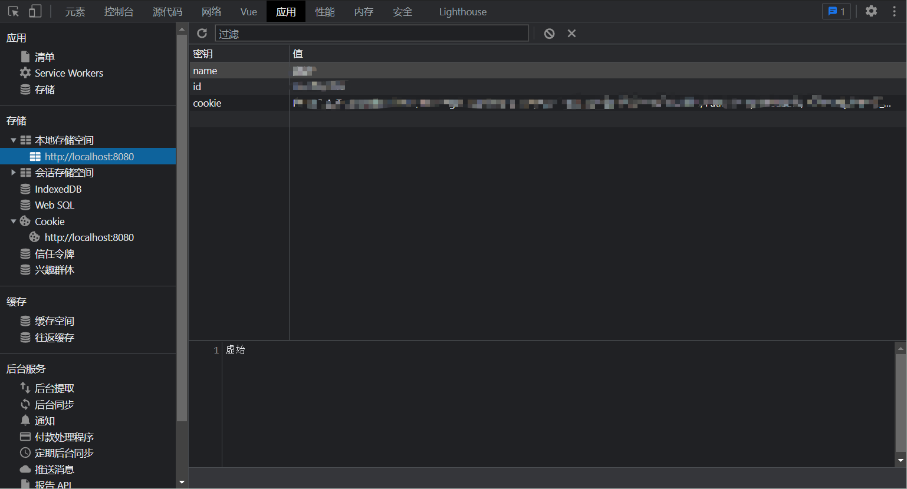
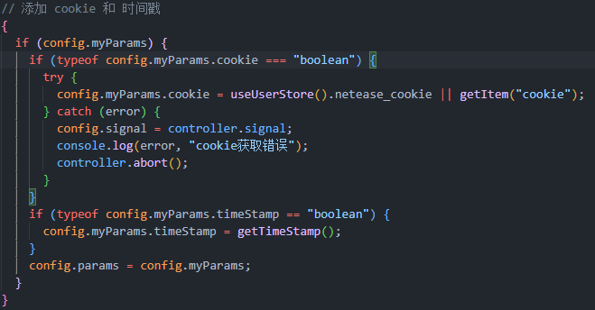

# Songs

## 项目介绍

该项目重构于以前写的一个音乐播放网站（vue3+js）,现在重构后切换为vue3+TS开发。对以前乱写一通的代码、混乱的命名和目录结构进行了一定的优化，可能吧。

该项目只是一个前端网页，后端数据使用的是部署在我的服务器上的[Binaryify的网易云API服务](https://github.com/Binaryify/NeteaseCloudMusicApi)。

## 用户信息（cookie）

### 存储位置

用户扫描二维码登录后会返回cookie字符串，cookie会存储在**LocalStorage**和**pinia**上面，服务器不会存储cookie。cookie是识别用户的唯一标识。

用户通过账号密码登录会返回token和cookie，但是账号密码登录存在问题，因此也就没写相关的页面和逻辑。



### 使用时机

在使用一些需要权限的api数据的时候，如我的歌单、我的专辑、收藏删除歌单的时候，需要携带cookie用来证明身份，（传给网易云API服务，该服务可能需要进一步处理，但不在我的考虑范围之内），本项目携带cookie的方式是在url字符串进行拼接。

携带cookie相关操作的代码在 src\service\request\index.ts ，在发生发生请求时可以传入一个 myParams对象，需要携带cookie时可以设置cookie为true或者传入cookie字符串

```ts
NETEASE.get({
  url: `/lyric/new`,
  myParams: {
    cookie: true,
  }
});
```



### 用户登录判断

进入页面的时候会在LocalStorage里查找是否有cookie信息，如果存在则认为已登录。
